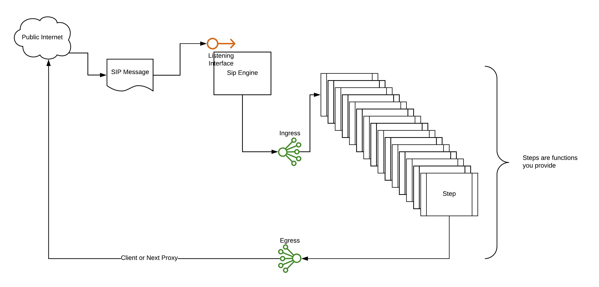

# SipEngine

SipEngine is a go-based take on the traditional SIP proxy (FreeSwitch, OpenSIPS). As
opposed to creating a lexed configuration language, this library can be imported
and implemented however you choose. 

The engine itself takes a slice of `SIPStep` functions, which have a signature of
`func (message *Message) error`. You simply build your steps, put them into a slice 
and they will execute against every message that comes in

## Exiting
There are scenarios where we want to abandon processing at an earlier stage. If you 
return a `MessageTerminationError`, the engine will stop further processing. This does
mean, however, that you will still have to put your message onto the egress channel
for processing before returning that message. 